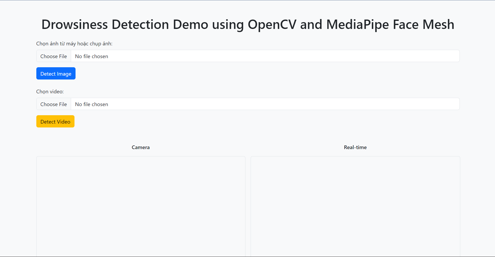

# 🥱 Drowsiness Detection with OpenCV and MediaPipe Face Mesh

A real-time drowsiness detection web application built with Flask, OpenCV, and MediaPipe Face Mesh. The system allows users to upload images, videos, or use real-time webcam input to detect whether a person is drowsy.

## 🧠 Project Description

The application uses Flask as the backend, OpenCV to process eye landmarks, and MediaPipe Face Mesh to locate facial landmarks, especially around the eyes. With an intuitive interface, users can easily upload images, videos, or stream live from a webcam to detect drowsiness in real time.

## 🛠️ Technologies

- Python 3.x
- Flask
- MediaPipe Face Mesh
- OpenCV

## ✨ Demo


## 📁 Project Structure

```
drowsiness-detection/
├── app.py                 # Flask application
├── utils.py               # Helper functions for landmark detection and eye state analysis
├── requirements.txt       # List of required dependencies
├── templates/             # HTML interface
├── static/                # JavaScript files for frontend logic
└── uploads/               # Folder to store uploaded images
```

## 🚀 Installation and Running

1. **Clone repository:**

   ```bash
   git clone https://github.com/dattrieuK17/drowsiness-detection.git
   cd drowsiness-detection
   ```

2. **Create a virtual environment and install dependencies:**

   ```bash
   python -m venv venv
   source venv/bin/activate  # On Windows: venv\Scripts\activate
   pip install -r requirements.txt
   ```


3. **Run:**

   ```bash
   python app.py
   ```

4. **Access the application:**

   Open your browser and go to `http://localhost:5000`.

## 📸 Main Features

- Upload images or videos to detect drowsiness.

- Real-time webcam support.

- Visualize detection results directly in the web interface.


